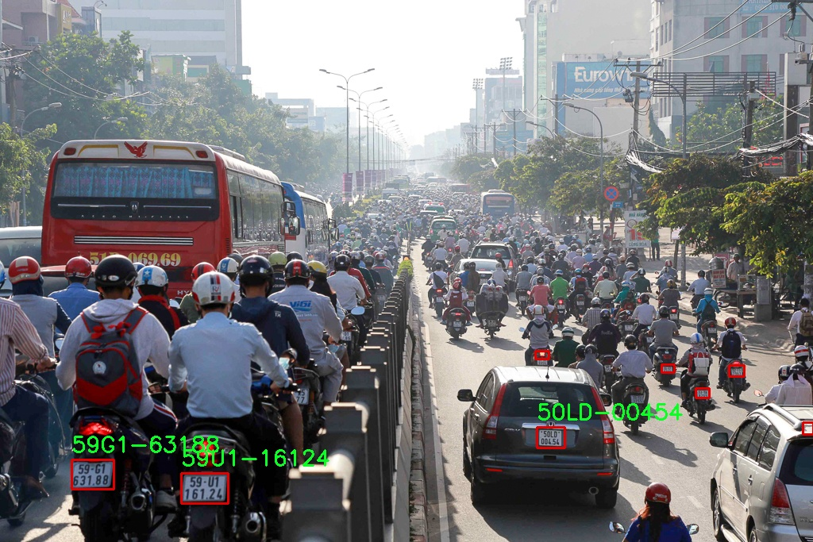
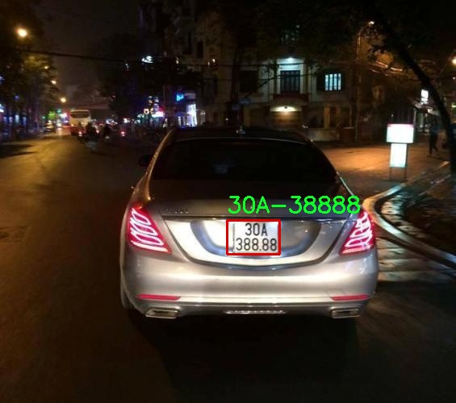
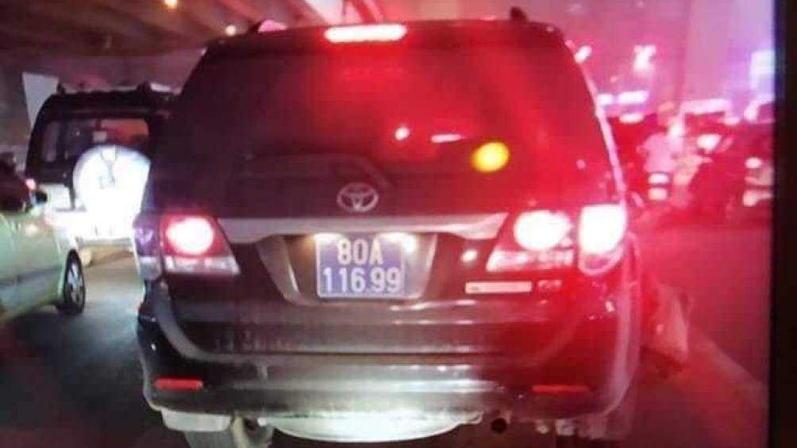
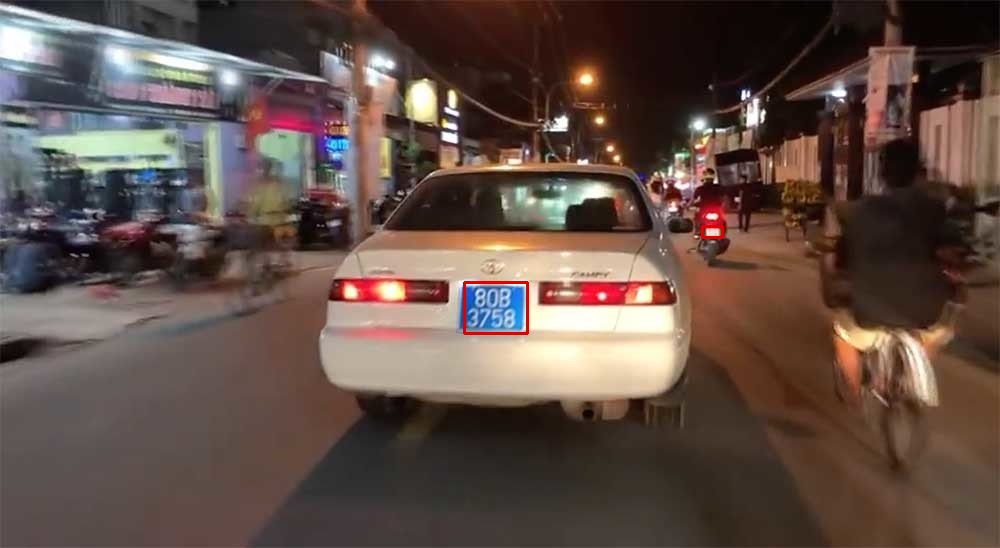

# Vietnamese License Plate Recognition
## Tasks
* Detect license plate(s) in an image, a video or realtime.
* Extract characters from detected license plate(s).

## How to inference
You can run the Python file with the following code

```
python detect.py \
        --modality <image-or-video-or-realtime> \
        --confidence <confidence-threshold-for-ocr> \
        --src <path-to-videos-or-images> \
        --out <path-to-output-directory>
```

Or the provided script files

```
# For image
bash detect_image.sh

# For video
bash detect_video.sh

# For realtime
bash detect_realtime.sh
```

## Results



## Challenges
### Too bright

### Blurry
